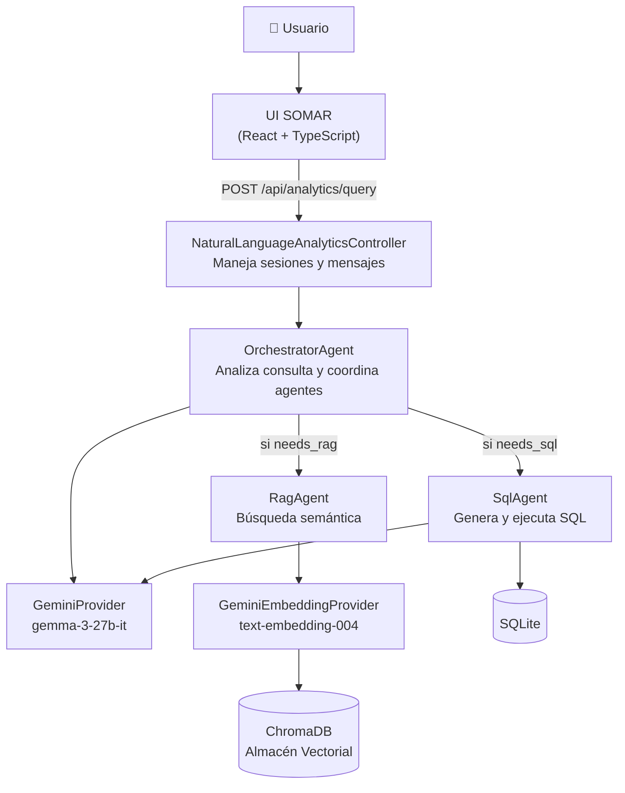
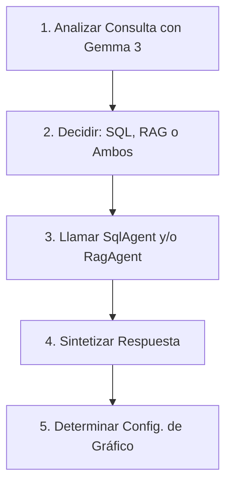
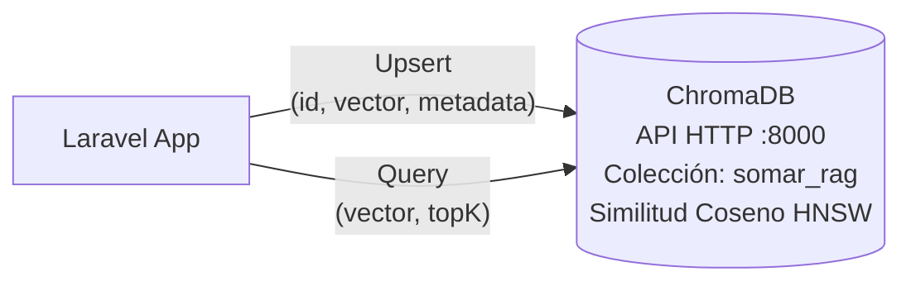
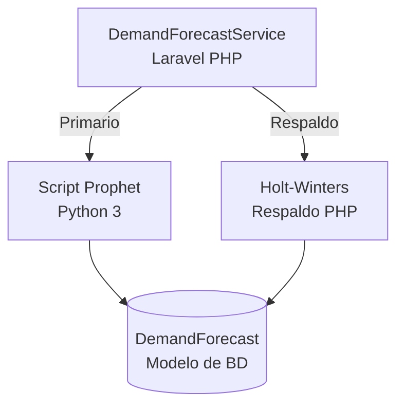
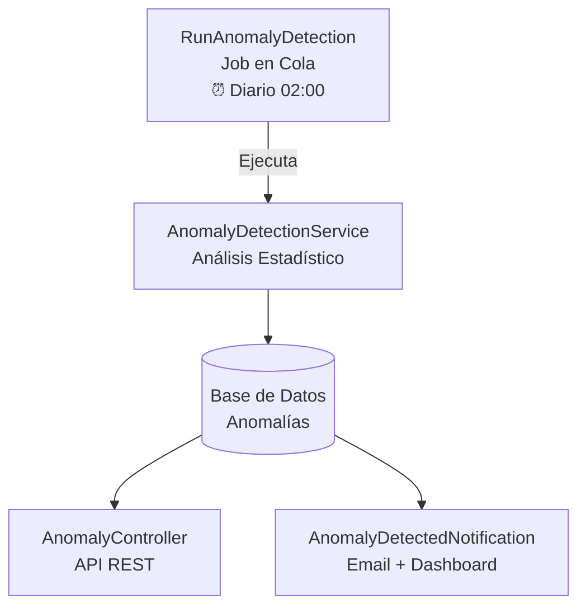

# SOMAR App – Arquitectura de IA

> **SOMAR App – Arquitectura de IA**  
> Guía de Referencia para Desarrolladores  
> Equipo de Desarrollo – Rivka Technologies  
> Última actualización: 

Guía rápida de la arquitectura de IA para desarrolladores que trabajan en SOMAR App.  
Este documento replica la **Referencia Técnica de Arquitectura de IA** original en formato web, optimizada para lectura en pantalla e impresión en PDF.

---

## Índice

1. Qué Hay en Este Código  
2. Visión General de la Arquitectura  
3. Módulo de Analítica de Lenguaje Natural  
4. Servicio de Pronóstico de Demanda  
5. Diagramas de Flujo de Datos  
6. Consideraciones de Seguridad  
7. Formatos de Respuesta  
8. Configuración  
9. Sistema de Detección de Anomalías  

---

## 1. Qué Hay en Este Código

SOMAR tiene tres sistemas de IA que necesitas conocer:

1. **Analítica de Lenguaje Natural (NLA)**  
   Sistema multi‑agente que permite a los usuarios consultar datos del negocio usando lenguaje natural, combinando enfoques de *Text‑to‑SQL* y *RAG* (Generación Aumentada por Recuperación).

2. **Servicio de Pronóstico de Demanda**  
   Sistema de analítica predictiva usando **Facebook Prophet** y algoritmos **Holt‑Winters** para optimización de inventario.

3. **Sistema de Detección de Anomalías**  
   Monitoreo automático de ventas e inventarios para detectar patrones inusuales usando análisis estadístico (media móvil y desviación estándar).

### 1.1. Stack Técnico

- Proveedor LLM: **Google Gemini** (modelo **Gemma 3 27B‑IT**).
- Embeddings: **Gemini `text-embedding-004`**.
- Base de datos vectorial: **ChromaDB**.
- Series temporales: **Facebook Prophet** con respaldo **Holt‑Winters**.
- Detección de anomalías: análisis estadístico (media móvil y desviación estándar).
- Backend: **Laravel PHP**.
- Frontend: **React con TypeScript**.
- Inter‑proceso: subproceso **Python** para pronósticos.

---

## 2. Visión General de la Arquitectura

### 2.1. Diagrama de Arquitectura de Alto Nivel



_Nota_: el diagrama original se muestra aquí como una descripción textual simplificada para evitar errores de renderizado al generar el PDF.

### 2.2. Resumen de Componentes

| Componente              | Tipo       | Propósito                                                                 |
| ----------------------- | ---------- | ------------------------------------------------------------------------- |
| `OrchestratorAgent`    | Agente     | Punto de entrada. Analiza la consulta, decide SQL/RAG/ambos y sintetiza. |
| `SqlAgent`             | Agente     | Genera y ejecuta consultas SQL con reintentos automáticos.               |
| `RagAgent`             | Agente     | Búsqueda semántica en ChromaDB usando embeddings.                         |
| `GeminiProvider`       | Proveedor  | Proveedor LLM para generación de texto (Gemma 3 27B).                     |
| `GeminiEmbeddingProvider` | Proveedor | Genera embeddings para búsqueda vectorial.                                |
| `ChromaDBStore`        | Almacén    | Almacena y busca documentos por similitud semántica.                      |
| `DatabaseSyncService`  | Servicio   | Sincroniza registros de BD al almacén vectorial.                          |
| `DemandForecastService`| Servicio   | Pronósticos de demanda con Prophet/Holt‑Winters.                          |

> Nota: existen clases `AnalyticsRouter`, `HybridStrategy`, `TextToSqlStrategy` y `RagStrategy` en el código, pero no se usan actualmente. Todo el enrutamiento lo hace `OrchestratorAgent`.

---

## 3. Módulo de Analítica de Lenguaje Natural

El módulo de Analítica de Lenguaje Natural (NLA) permite a los usuarios interactuar con la base de datos usando consultas en lenguaje natural en inglés o español.

### 3.1. Estructura de Directorios

```text
app/Services/NaturalLanguageAnalytics/
├─ Agents/                     # Activamente usado
│  ├─ OrchestratorAgent.php    # Punto de entrada principal
│  ├─ SqlAgent.php             # Genera y ejecuta SQL
│  └─ RagAgent.php             # Búsqueda semántica
├─ Contracts/                  # Interfaces
│  ├─ AnalyticsProviderInterface.php
│  ├─ EmbeddingProviderInterface.php
│  └─ VectorStoreInterface.php
├─ Providers/
│  ├─ GeminiProvider.php
│  └─ GeminiEmbeddingProvider.php
└─ VectorStores/
   └─ ChromaDBStore.php
```

### 3.2. Interfaces Principales (Contratos)

#### 3.2.1. `AnalyticsProviderInterface`

Define el contrato para proveedores LLM:

- `generateText()` genera texto desde un *prompt* con contexto opcional.
- `generateStructured()` genera salida JSON estructurada siguiendo un esquema.

```php
public function generateText(
    string $prompt,
    array $context = [],
    ?string $model = null
): string;

public function generateStructured(
    string $prompt,
    array $schema,
    ?string $model = null
): array;
```

#### 3.2.2. `EmbeddingProviderInterface`

Define el contrato para proveedores de embeddings:

- `embed()` genera un solo vector de embedding.
- `embedBatch()` genera múltiples vectores de embedding.

```php
public function embed(string $text): array;      // Retorna array<float>
public function embedBatch(array $texts): array; // Retorna array<array<float>>
```

#### 3.2.3. `VectorStoreInterface`

Define operaciones CRUD para bases de datos vectoriales:

- `upsert()` insertar o actualizar un vector con metadatos.
- `query()` búsqueda por similitud semántica.
- `delete()` eliminar un documento por ID.
- `deleteAll()` limpiar toda la colección.

#### 3.2.4. `QueryStrategyInterface`

Patrón de estrategia para procesamiento de consultas:

- `canHandle()` determina si la estrategia aplica a la consulta.
- `process()` ejecuta la estrategia y retorna una respuesta estructurada.

### 3.3. Arquitectura Multi‑Agente

El sistema implementa una arquitectura multi‑agente para manejo de consultas complejas.

#### 3.3.1. `OrchestratorAgent`



`OrchestratorAgent` es el coordinador principal que:

1. Analiza la consulta del usuario y el historial de conversación.
2. Decide qué datos se necesitan (numéricos, cualitativos o ambos).
3. Coordina `SqlAgent` y `RagAgent`.
4. Sintetiza la respuesta final.
5. Determina la configuración del gráfico (cuando aplica).

El orquestador usa un análisis interno basado en Gemma 3 con un formato de decisión JSON:

```json
{
  "needs_sql": true,
  "sql_request": "...",
  "needs_rag": true,
  "rag_request": "..."
}
```

#### 3.3.2. `SqlAgent`

Responsabilidades principales:

- Usa un esquema de BD embebido para consultas precisas.
- Implementa un mecanismo de reintento (hasta 3 intentos) con contexto de error.
- Aplica seguridad estricta: bloquea `DELETE`, `UPDATE`, `INSERT`, `DROP`, `ALTER`, `TRUNCATE`, `CREATE`.
- Utiliza Gemma 3 27B‑IT para generación de SQL.

Ejemplo de esquema embebido (resumen):

```text
Tablas:
- products (id, name, sku, code, presentation, description, brand_id, division_id)
- brands (id, name)
- divisions (id, name)
- wholesalers (id, name)
- branches (id, name, code, wholesaler_id)
- inventories (id, product_id, branch_id, wholesaler_id, stock, transit, ddi, date)
- sales (id, product_id, branch_id, wholesaler_id, quantity, date)
- companies (id, name)
- documents (id, name, path, wholesaler_id)
```

#### 3.3.3. `RagAgent`

`RagAgent` recupera contexto cualitativo del almacén vectorial:

1. Genera un embedding para la consulta usando `GeminiEmbeddingProvider`.
2. Consulta `ChromaDBStore` para los documentos más similares.
3. Construye una cadena de contexto con puntajes de relevancia.
4. Retorna contexto formateado listo para síntesis.

Ejemplo de formato de contexto:

```text
- [product] Producto: PENPROCILINA. SKU: ABC123. Marca: Pharma Co.
- [branch] Sucursal: Centro. Mayorista: Nadro.
```

### 3.4. Cómo Funciona el Enrutamiento

`OrchestratorAgent` decide automáticamente qué agentes usar para cada consulta.  
No existe un *router* separado: todo el enrutamiento es interno al orquestador.

### 3.5. Proveedores LLM

#### 3.5.1. `GeminiProvider`

- **Endpoint API:** `generativelanguage.googleapis.com/v1beta`
- **Modelo por defecto:** `gemma-3-27b-it`
- **Formatos:** Texto plano y JSON estructurado
- **Auth:** Clave API desde `GEMINI_API_KEY`

#### 3.5.2. `GeminiEmbeddingProvider`

- **Modelo:** `text-embedding-004`
- **Salida:** Representación vectorial densa
- **Lote:** Procesamiento secuencial (sin endpoint batch nativo)

### 3.6. Almacén Vectorial: ChromaDB


Endpoints API utilizados:

- `GET /api/v2/.../collections/{name}` — Obtener colección
- `POST /api/v2/.../collections` — Crear colección
- `POST /api/v2/.../collections/{id}/upsert` — Insertar vectores
- `POST /api/v2/.../collections/{id}/query` — Búsqueda por similitud
- `POST /api/v2/.../collections/{id}/delete` — Eliminar vectores

### 3.7. Servicio de Sincronización de Base de Datos

El `DatabaseSyncService` llena el almacén vectorial con registros de la base de datos:

| Modelo     | Formato ID          | Plantilla de Texto                                              |
| ---------- | ------------------- | --------------------------------------------------------------- |
| Producto   | `products_{id}`     | Nombre, SKU, Código, Presentación, Descripción, Marca, División |
| Sucursal   | `branches_{id}`     | Nombre, Código, Mayorista                                       |
| Empresa    | `companies_{id}`    | Nombre                                                          |
| Mayorista  | `wholesalers_{id}`  | Nombre                                                          |

---

## 4. Servicio de Pronóstico de Demanda

El sistema de pronóstico de demanda proporciona gestión inteligente de inventario a través de predicción de series temporales.

### 4.1. Visión General de Arquitectura



### 4.2. Configuración de Algoritmos

#### 4.2.1. Facebook Prophet

Configuración típica:

```python
Prophet(
  daily_seasonality=False,
  weekly_seasonality=True,
  yearly_seasonality=True if len(df) > 365 else False,
  changepoint_prior_scale=0.05,   # Tendencia conservadora
  seasonality_prior_scale=10,
  interval_width=0.95             # Intervalo de confianza 95 %
)
```

#### 4.2.2. Suavizado Exponencial Holt‑Winters

Parámetros Holt‑Winters:

- `α = 0.3` (suavizado de nivel)  
- `β = 0.1` (suavizado de tendencia)  
- `Z = 1.65` (factor de nivel de servicio para 95 %)

Ecuaciones principales (resumidas):

- Nivel: `Lt = α · Yt + (1 − α) · (Lt−1 + Tt−1)`
- Tendencia: `Tt = β · (Lt − Lt−1) + (1 − β) · Tt−1`
- Pronóstico: `Ŷt+h = Lt + h · Tt`

### 4.3. Cálculo de Stock de Seguridad

`Stock de Seguridad = Z × σd × √L`

Donde:

- `Z` = 1.65 (nivel de servicio 95 %).  
- `σd` = desviación estándar de la demanda.  
- `L` = tiempo de entrega en días (por defecto: 7).

### 4.4. Cantidad Sugerida de Reorden

`Cantidad de Reorden = Demanda Pronosticada + Stock de Seguridad − Stock Actual`

### 4.5. Evaluación de Calidad de Datos

| Calidad    | Puntos de Datos | Puntos No Cero |
| ---------- | --------------- | -------------- |
| Buena      | ≥ 30            | ≥ 10           |
| Limitada   | ≥ 14            | ≥ 3            |
| Insuficiente | < 14          | < 3            |

### 4.6. Script Prophet (Python)

Uso desde Laravel:

```bash
python prophet_forecast.py \
  --input=sales_data.json \
  --output=forecast.json \
  --days=30 \
  --lead-time=7
```

---

## 5. Diagramas de Flujo de Datos

### 5.1. Flujo de Consulta en Lenguaje Natural

1. El usuario envía una consulta, por ejemplo: “¿Cuáles son los productos más vendidos?”.
2. El router (histórico) o `OrchestratorAgent` clasifica la consulta → SQL.
3. Se genera el SQL vía Gemini (Text‑to‑SQL).
4. El SQL se ejecuta en la base de datos (`SELECT p.name, SUM(s.quantity) ...`).
5. Los resultados se formatean y el LLM genera una respuesta en lenguaje natural.
6. Se determina la configuración del gráfico (barras/pie según cantidad de filas).
7. La respuesta final incluye `{type, content, data, chartConfig}`.

### 5.2. Flujo de Indexación RAG

1. `DatabaseSyncService` carga productos, sucursales, empresas y mayoristas.
2. Cada registro se convierte a texto (“Producto: PENPROCILINA. SKU: ABC...”).
3. `GeminiEmbeddingProvider` genera un vector de embedding.
4. `ChromaDBStore` hace *upsert* `(id, vector, metadata)` en la colección `somar_rag`.
5. El proceso se repite para todos los registros con *callbacks* de progreso.

---

## 6. Consideraciones de Seguridad

### 6.1. Prevención de Inyección SQL

`SqlAgent` implementa múltiples capas de seguridad:

1. **Bloqueo de palabras clave**: operaciones peligrosas son rechazadas (`DELETE`, `UPDATE`, `INSERT`, `DROP`, `ALTER`, `TRUNCATE`, `CREATE`).
2. **Validación SELECT**: solo se ejecutan sentencias `SELECT`.
3. **Refuerzo de solo lectura**: el *prompt* instruye explícitamente que las consultas sean de solo lectura.

Ejemplo de verificación:

```php
protected function isUnsafe(string $sql): bool
{
    $dangerous = ['DELETE', 'UPDATE', 'INSERT', 'DROP', 'ALTER', 'TRUNCATE', 'CREATE'];
    $upperSql = strtoupper($sql);

    foreach ($dangerous as $keyword) {
        if (str_contains($upperSql, $keyword)) {
            return true;
        }
    }

    return false;
}
```

### 6.2. Gestión de Claves API

- Claves API almacenadas en variables de entorno, por ejemplo `GEMINI_API_KEY`.
- Nunca se almacenan claves directamente en el código fuente.
- Configuración centralizada en `config/services.php` de Laravel.

---

## 7. Formatos de Respuesta

Todas las estrategias retornan una estructura de respuesta consistente:

```php
[
  'type'   => 'text' | 'chart',
  'content'=> 'Respuesta formateada en Markdown',
  'data'   => [... ] | null, // Datos crudos para gráficos
  'chartConfig' => [
    'chartType' => 'bar' | 'pie' | 'line' | 'table',
    'xAxis'     => 'nombre_columna',
    'yAxis'     => 'columna_numerica',
    'title'     => 'Título del Gráfico',
  ] | null,
]
```

Selección de tipo de gráfico:

- Gráfico de **pie**: ≤ 6 puntos de datos.
- Gráfico de **barras**: > 6 y ≤ 30 puntos de datos.
- **Solo texto**: > 30 puntos de datos o valor único.

---

## 8. Configuración

### 8.1. Variables de Entorno

| Variable              | Ejemplo                | Propósito                          |
| --------------------- | ---------------------- | ---------------------------------- |
| `GEMINI_API_KEY`      | `AIza...`              | Autenticación API de Google AI     |
| `VECTORDB_HOST`       | `http://localhost:8000`| URL del servidor ChromaDB          |
| `VECTORDB_COLLECTION` | `somar_rag`            | Nombre de colección en ChromaDB    |

### 8.2. Dependencias de Python

`requirements.txt` para pronósticos:

```text
prophet >= 1.1.5
pandas  >= 2.0.0
numpy   >= 1.24.0
```

---

## 9. Sistema de Detección de Anomalías

El sistema de detección de anomalías monitorea automáticamente las ventas e inventarios para identificar patrones inusuales que podrían indicar problemas operativos o fraude.

### 9.1. Visión General de Arquitectura



### 9.2. Estructura de Directorios

```text
app/
├─ Services/AnomalyDetection/
│  └─ AnomalyDetectionService.php   # Lógica de detección
├─ Models/
│  └─ Anomaly.php                   # Modelo Eloquent
├─ Jobs/
│  └─ RunAnomalyDetection.php       # Job programado
├─ Notifications/
│  └─ AnomalyDetectedNotification.php
├─ Http/Controllers/
│  └─ AnomalyController.php         # API REST
config/
└─ anomaly.php                      # Configuración

database/migrations/
└─ 2025_12_18_..._create_anomalies_table.php

resources/js/
├─ components/AnomalyNotificationPanel.tsx
├─ pages/Anomalies/Anomalies.tsx
├─ services/anomalyService.ts
└─ types/anomalyType.ts
```

### 9.3. Tipos de Anomalías Detectadas

| Tipo                   | Código                | Descripción                                          |
| ---------------------- | --------------------- | ---------------------------------------------------- |
| Pico de Ventas         | `sales_spike`         | Ventas inusualmente altas (ej. 500 % sobre lo normal) |
| Caída de Ventas        | `sales_drop`          | Ventas inusualmente bajas                            |
| Merma de Inventario    | `inventory_shrinkage` | Stock desaparece sin ventas correspondientes         |
| Discrepancia de Inventario | `inventory_mismatch` | Niveles no coinciden con expectativas              |

### 9.4. Algoritmo de Detección

El sistema usa análisis estadístico basado en **media móvil** y **desviación estándar**:

- Media móvil:  
  `x̄ = (1/n) · Σ xi`

- Desviación estándar:  
  `σ = sqrt( Σ (xi − x̄)² / (n − 1) )`

- Factor de desviación:  
  `factor = |x_actual − x̄| / σ`

Parámetros:

- Ventana de media móvil: `30` días (configurable).
- Umbral de desviación: `3.0` desviaciones estándar.
- Mínimo de datos: `7` puntos históricos requeridos.

### 9.5. Clasificación de Severidad

| Severidad | Factor de Desviación | Color   |
| --------- | -------------------- | ------- |
| Baja      | 3.0 – 4.0            | Azul    |
| Media     | 4.0 – 5.0            | Amarillo|
| Alta      | 5.0 – 6.0            | Naranja |
| Crítica   | ≥ 6.0                | Rojo    |

### 9.6. API REST de Anomalías

Endpoints principales:

| Método | Endpoint                          | Descripción                         |
| ------ | --------------------------------- | ----------------------------------- |
| GET    | `/api/anomalies`                 | Listar con filtros y paginación     |
| GET    | `/api/anomalies/{id}`            | Detalle de una anomalía             |
| PATCH  | `/api/anomalies/{id}`            | Actualizar estado / notas           |
| GET    | `/api/anomalies/summary`         | Estadísticas para dashboard         |
| GET    | `/api/anomalies/recent`          | Anomalías recientes                 |
| POST   | `/api/anomalies/bulk-acknowledge`| Marcar varias como vistas           |
| POST   | `/api/anomalies/run-detection`   | Ejecutar detección manual           |

Parámetros de filtrado soportados:

- `type`: `sales_spike`, `sales_drop`, `inventory_shrinkage`, `inventory_mismatch`
- `severity`: `low`, `medium`, `high`, `critical`
- `status`: `new`, `acknowledged`, `resolved`, `false_positive`
- `product_id`, `branch_id`
- `start_date`, `end_date`

### 9.7. Componente Frontend

#### 9.7.1. Panel de Notificaciones

`AnomalyNotificationPanel`:

- Muestra un icono de campana con *badge* (anomalías críticas + altas).
- Popover con últimas 10 anomalías y colores por severidad.
- Acciones rápidas: marcar como vista, ver detalles.
- *Polling* automático cada 60 segundos.

#### 9.7.2. Página de Anomalías

La página `/anomalies` incluye:

- Tarjetas de resumen (sin resolver, críticas, altas, esta semana).
- Tabla con filtros por tipo, severidad y estado.
- Selección múltiple para acciones en lote.
- Modal de detalle para resolver o marcar como falso positivo.

### 9.8. Programación del Job

Programación típica en `routes/console.php`:

```php
Schedule::job(new RunAnomalyDetection)
    ->dailyAt(config('anomaly.schedule.daily_at', '02:00'))
    ->name('anomaly-detection')
    ->withoutOverlapping()
    ->onOneServer();
```

### 9.9. Configuración

Variables de entorno relevantes:

| Variable                    | Default | Propósito                      |
| --------------------------- | ------- | ------------------------------ |
| `ANOMALY_MOVING_AVERAGE_DAYS` | 30    | Ventana de media móvil         |
| `ANOMALY_DEVIATION_THRESHOLD`| 3.0   | Umbral de desviación           |
| `ANOMALY_MIN_DATA_POINTS`    | 7     | Mínimo de datos históricos     |
| `ANOMALY_SCHEDULE_TIME`      | 02:00 | Hora de ejecución diaria       |
| `ANOMALY_EMAIL_ENABLED`      | false | Activar emails                 |
| `ANOMALY_ADMIN_EMAILS`       |       | Lista de correos de administradores |
| `ANOMALY_EMAIL_MIN_SEVERITY` | high  | Severidad mínima para email    |

### 9.10. Sistema de Notificaciones

- **Dashboard** (siempre activo): anomalías almacenadas en BD y mostradas en panel.
- **Email** (desactivado por defecto): requiere configuración SMTP y variables de entorno.

Ejemplo de configuración de email en `.env`:

```text
MAIL_MAILER=smtp
MAIL_HOST=smtp.example.com
MAIL_PORT=587
MAIL_USERNAME=your-email
MAIL_PASSWORD=your-password

ANOMALY_EMAIL_ENABLED=true
ANOMALY_ADMIN_EMAILS=admin@company.com,ops@company.com
```

---

